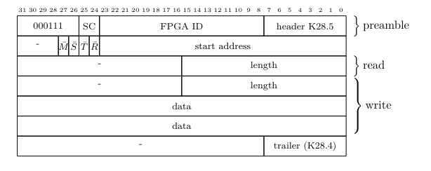
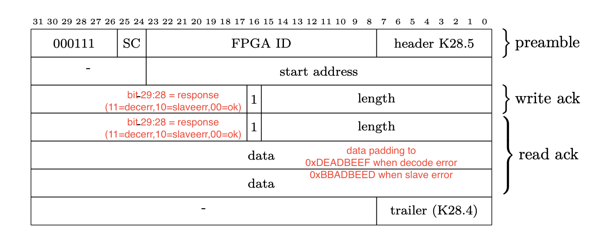

# Slow Control Hub Mu3E IP

8B10B slow-control packet bridge with Avalon-MM/AXI4 master, backpressure FIFO,
and ordered/atomic transaction support.  Translates Mu3e SC packets arriving on
the 8B10B downlink into Avalon Memory-Mapped (or AXI4) bus transactions and
returns reply packets on the uplink.

**Version:** 26.5.0.0411
**Module name:** `sc_hub_top` (Avalon-MM), `sc_hub_top_axi4` (AXI4)
**Platform Designer group:** Mu3e Control Plane/Modules

---

## Use Case

The Mu3e front-end boards (FEBs) receive slow-control command packets from the
Switching Board (SWB) over an 8B10B serial link.  Each command carries a target
address, read/write type, burst length, and optional ordering/atomic constraints.
The SC Hub IP is instantiated on every FEB to:

1. **Decode** incoming SC packets (header, payload, K-character framing).
2. **Translate** the packet into one or more Avalon-MM (or AXI4) bus
   transactions directed at downstream peripherals (MuTRiG configurators,
   OneWire controllers, MAX10 programming interfaces, etc.).
3. **Collect** read data or write responses and assemble a reply packet.
4. **Transmit** the reply packet upstream through the backpressure FIFO.

Typical deployment on a SciFi FEB:

- **Register access:** single-word reads/writes to MuTRiG slow-control
  registers via the Qsys interconnect.
- **Burst programming:** multi-word writes to configure ASICs or reprogram
  the MAX10 flash.
- **Diagnostics:** read the hub's own CSR window (address `0xFE80..0xFE9F`)
  for FIFO status, error flags, and packet counters.
- **Ordered transactions:** enforce acquire/release ordering across domains
  when coordinating multi-ASIC calibration sequences.

---

## Architecture

```
                        +-----------+
  i_download_data  ---->| pkt_rx    |
  i_download_datak ---->|           |
                        |  header   |
                        |  decode + |---> pkt_info + wr_data FIFO
                        |  payload  |
                        |  FIFO     |
                        +-----------+
                              |
                     +--------v--------+
                     |                  |
                     |    core FSM      |<--- avs_csr (host CSR)
                     |                  |
                     | dispatch, fill,  |
                     | stream, pad,     |
                     | reply, atomic    |
                     |                  |
                     +---+---------+----+
                         |         |
              +----------v--+  +---v-----------+
              | avmm_handler|  | pkt_tx        |
              | (or axi4_   |  | (reply        |
              |  handler +  |  |  assembly +   |
              |  ooo_handler)|  |  BP FIFO)    |
              +------+------+  +-------+-------+
                     |                 |
              avm_hub_*          aso_upload_*
              (Avalon-MM /       (Avalon-ST
               AXI4 master)       uplink)
```

### Pipeline Overview

| Stage | Component | Description |
|-------|-----------|-------------|
| 1 | `sc_hub_pkt_rx` | K-character framing, header decode, payload FIFO (depth configurable) |
| 2 | `sc_hub_core` | Main FSM: dispatch internal/external, fill read FIFO, stream write data, pad short replies, arm TX |
| 3 | `sc_hub_avmm_handler` | Avalon-MM burst master with read/write timeout |
| 3a | `sc_hub_axi4_handler` | AXI4 burst master (alternative to AVMM) |
| 3b | `sc_hub_axi4_ooo_handler` | Out-of-order AXI4 completion tracker |
| 4 | `sc_hub_pkt_tx` | Reply packet assembly, backpressure FIFO (store-and-forward or cut-through) |

### Bus Variants

| Top-level entity | Bus protocol | OoO support |
|------------------|-------------|-------------|
| `sc_hub_top` | Avalon-MM | External bus completion remains ordered. `OOO_ENABLE` can still be compiled in, but Avalon-MM itself does not provide true out-of-order completion. |
| `sc_hub_top_axi4` | AXI4 | Out-of-order via tagged slots (`OOO_SLOT_COUNT` slots) |

### Backpressure FIFO

The current v2 datapath always uses the internal reply FIFO
(`sc_hub_fifo_bp`). The FIFO depth (`BP_FIFO_DEPTH`, default 512 words)
absorbs uplink stalls.

`BACKPRESSURE` is now a compatibility-facing admission-control knob rather than
"enable or disable the FIFO". When `BACKPRESSURE = true` (default), the hub
stops accepting new download packets once the uplink FIFO reaches the half-full
threshold. When `BACKPRESSURE = false`, the FIFO still exists, but this
half-full throttling is disabled.

`SCHEDULER_USE_PKT_TRANSFER` is also retained for compatibility with older
generated systems. The current v2 reply path still emits fully packetized
replies from the internal FIFO regardless of this generic.

### Ordering and Atomics

When `ORD_ENABLE = true`, the hub respects the per-packet ordering mode
(relaxed, release, acquire) and domain/epoch/scope fields.  Acquire-mode
packets hold the pipeline until all prior packets in the same domain have
drained.

When `ATOMIC_ENABLE = true`, the hub supports read-modify-write atomic
operations: it reads the target word, applies a bitwise mask and data
modification, and writes back the result -- all within a single packet
transaction that blocks the pipeline.

---

## CSR Register Map

All registers are word-addressed through the `csr` Avalon-MM slave (5-bit
address, read latency 1).  The CSR window occupies addresses `0xFE80..0xFE9F`
(32 words) in the SC address space.  Words 0-1 form the standard identity
header (shared across all Mu3e IP cores).

| Word | Name | Access | Description |
|------|------|--------|-------------|
| 0x00 | UID | RO | IP identifier: ASCII "SCHB" = 0x53434842 (immutable) |
| 0x01 | META | RW/RO | Write: sets page selector `[1:0]`. Read: returns selected page (0=VERSION, 1=DATE, 2=GIT, 3=INSTANCE_ID) |
| 0x02 | CTRL | RW | Bits 0=enable, 1=diag_clear, 2=soft_reset. Writing bit1 or bit2 clears sticky diagnostics and counters; bit2 also requests a local soft reset pulse. |
| 0x03 | STATUS | RO | `[0]` busy, `[1]` error, `[2]` dl_fifo_full, `[3]` bp_full, `[4]` enable, `[5]` bus_busy |
| 0x04 | ERR_FLAGS | RW1C | `[0]` up_overflow, `[1]` down_overflow, `[2]` int_addr_err, `[3]` rd_timeout, `[4]` pkt_drop, `[5]` slverr, `[6]` decerr |
| 0x05 | ERR_COUNT | RO | Saturating 32-bit error event counter |
| 0x06 | SCRATCH | RW | General-purpose scratch register |
| 0x07 | GTS_SNAP_LO | RO | Global timestamp snapshot `[31:0]` |
| 0x08 | GTS_SNAP_HI | RO | Global timestamp snapshot `[47:32]` (reading triggers new snapshot) |
| 0x09 | FIFO_CFG | RW | `[0]` backpressure_on readback (fixed `1` in v2), `[1]` store_forward |
| 0x0A | FIFO_STATUS | RO | `[0]` dl_full, `[1]` bp_full, `[2]` dl_overflow, `[3]` bp_overflow, `[4]` rd_fifo_full, `[5]` rd_fifo_empty |
| 0x0B | DOWN_PKT_CNT | RO | `[0]` download-packet occupancy summary bit. `1` means the hub is non-idle or still has deferred work; this is not an accumulated packet counter. |
| 0x0C | UP_PKT_CNT | RO | Current reply-packet count in the backpressure FIFO. With the default depth 512 this is a 10-bit field. |
| 0x0D | DOWN_USEDW | RO | Current used-word count of the download payload FIFO. With the default depth 256 this is a 10-bit field. |
| 0x0E | UP_USEDW | RO | Current used-word count of the backpressure FIFO. With the default depth 512 this is a 10-bit field. |
| 0x0F | EXT_PKT_RD | RO | External read packet counter (saturating) |
| 0x10 | EXT_PKT_WR | RO | External write packet counter (saturating) |
| 0x11 | EXT_WORD_RD | RO | External read word counter (saturating) |
| 0x12 | EXT_WORD_WR | RO | External write word counter (saturating) |
| 0x13 | LAST_RD_ADDR | RO | Last external read address |
| 0x14 | LAST_RD_DATA | RO | Last external read data |
| 0x15 | LAST_WR_ADDR | RO | Last external write address |
| 0x16 | LAST_WR_DATA | RO | Last external write data |
| 0x17 | PKT_DROP_CNT | RO | `[15:0]` dropped-packet counter |
| 0x18 | OOO_CTRL | RW | `[0]` runtime OoO enable (only effective when `OOO_ENABLE=true` at compile time) |
| 0x19 | ORD_DRAIN_CNT | RO | Ordered-mode drain event counter |
| 0x1A | ORD_HOLD_CNT | RO | Ordered-mode hold event counter |
| 0x1B | DBG_DROP_DETAIL | RO | Debug: last dropped packet detail |
| 0x1C-0x1E | RESERVED | RO | Unimplemented slots. Reads return slave error / debug fill value depending on access path. |
| 0x1F | HUB_CAP | RO | Capability bits: `[0]` OoO, `[1]` ordering, `[2]` atomic, `[3]` identity |

### META Page Encoding (Word 0x01)

| Page (`[1:0]`) | Content |
|----------------|---------|
| 0 | VERSION: `[31:24]` major, `[23:16]` minor, `[15:12]` patch, `[11:0]` build |
| 1 | DATE: build date as 32-bit integer (e.g. `0x20260411`) |
| 2 | GIT: short git hash as 32-bit integer |
| 3 | INSTANCE_ID: per-instance identifier set by Platform Designer |

---

## SC Packet Format

### Command Packet (SWB -> FEB)

```
Word 0: [31:30] type  [29:14] fpga_id  [13:0] start_address[23:10]
Word 1: [31:22] start_address[9:0]  [21:18] mask  [17:2] rw_length  [1:0] order_mode
Word 2: [31:28] order_domain  [27:20] order_epoch  [19:18] order_scope  [17] atomic_flag  ...
Word 3..N: write payload data (for write commands)
```

### Reply Packet (FEB -> SWB)

```
Word 0: [31:30] type  [29:14] fpga_id  [13:0] start_address[23:10]
Word 1: [31:22] start_address[9:0]  [21:18] mask  [17:2] rw_length  [1:0] response
Word 2..N: read payload data (for read replies)
```




---

## Generics

### sc_hub_top (Avalon-MM variant)

| Generic | Type | Default | Description |
|---------|------|---------|-------------|
| BACKPRESSURE | boolean | true | Compatibility generic that controls half-full admission throttling. The v2 datapath always keeps the reply FIFO instantiated. |
| SCHEDULER_USE_PKT_TRANSFER | boolean | true | Compatibility generic retained in the entity for legacy generated systems. |
| INVERT_RD_SIG | boolean | true | Invert polarity of upload ready signal |
| DEBUG | natural | 1 | Debug level (0=off, 1=synth, 2=sim) |
| OOO_ENABLE | boolean | false | Compile-time out-of-order support |
| ORD_ENABLE | boolean | true | Compile-time ordering support |
| ATOMIC_ENABLE | boolean | true | Compile-time atomic transaction support |
| HUB_CAP_ENABLE | boolean | true | Enable capability register |
| EXT_PLD_DEPTH | positive | 256 | Download payload FIFO depth |
| PKT_QUEUE_DEPTH | positive | 16 | Packet queue depth in RX |
| BP_FIFO_DEPTH | positive | 512 | Backpressure FIFO depth |
| RD_TIMEOUT_CYCLES | positive | 200 | Read timeout in clock cycles |
| WR_TIMEOUT_CYCLES | positive | 200 | Write timeout in clock cycles |
| OUTSTANDING_LIMIT | positive | 8 | Max outstanding packets |
| OUTSTANDING_INT_RESERVED | natural | 2 | Internal-address reserved slots |
| IP_UID | natural | 0x53434842 | UID word (ASCII "SCHB") |
| VERSION_MAJOR | natural | 26 | Version major |
| VERSION_MINOR | natural | 5 | Version minor |
| VERSION_PATCH | natural | 0 | Version patch |
| BUILD | natural | 0x0411 | Build stamp |
| VERSION_DATE | natural | 0x20260411 | Build date |
| VERSION_GIT | natural | 0 | Git short hash |
| INSTANCE_ID | natural | 0 | Per-instance ID set by Platform Designer |

---

## Directory Structure

```
slow-control_hub/
  sc_hub_top.vhd                -- Avalon-MM top-level entity
  sc_hub_top_axi4.vhd           -- AXI4 top-level entity
  sc_hub_core.vhd               -- Core FSM (Avalon-MM variant)
  sc_hub_axi4_core.vhd          -- Core FSM (AXI4 variant)
  sc_hub_pkg.vhd                -- Shared types, constants, functions
  sc_hub_pkt_rx.vhd             -- Packet receiver (header decode + payload FIFO)
  sc_hub_pkt_tx.vhd             -- Packet transmitter (reply assembly + BP FIFO)
  sc_hub_avmm_handler.vhd       -- Avalon-MM burst master with timeout
  sc_hub_axi4_handler.vhd       -- AXI4 burst master
  sc_hub_axi4_ooo_handler.vhd   -- AXI4 out-of-order completion tracker
  sc_hub_payload_ram.vhd        -- Payload storage RAM
  fifo/                          -- FIFO primitives
    sc_hub_fifo_sf.vhd           -- Store-and-forward FIFO
    sc_hub_fifo_sc.vhd           -- SC FIFO
    sc_hub_fifo_bp.vhd           -- Backpressure FIFO
  sc_hub_hw.tcl                  -- Platform Designer component descriptor (v1)
  sc_hub_v2_hw.tcl               -- Platform Designer component descriptor (v2)
  syn/quartus/                   -- Standalone synthesis signoff project
  tb/                            -- Testbench (standalone + UVM)
    Makefile                     -- Quick standalone simulation
    sim/                         -- Standalone test scripts
    uvm/                         -- Full UVM environment
  legacy/                        -- Archived prior versions
  pictures/                      -- SC packet format diagrams
```

---

## Quick Start

### Standalone Simulation

```bash
cd tb/
make compile          # compile DUT + testbench
make run TEST=t222    # run a specific test
```

### UVM Simulation

```bash
cd tb/uvm/
make compile
make run TEST=sc_hub_smoke_test
```

### Standalone Synthesis Signoff

```bash
cd syn/quartus/
quartus_sh --flow compile sc_hub_minimal_live -c sc_hub_minimal_live
```

---

## Version History

| Version | Date | Change |
|---------|------|--------|
| 26.5.0.0411 | 2026-04-11 | Standard CSR identity header (UID + META mux at words 0-1); identity generics |
| 26.4.1.0410 | 2026-04-10 | Widen avm_hub_address from 16 to 18 bits |
| 26.3.5.0411 | 2026-04-11 | Core FSM: same-ready RX handoff, same-cycle final-beat padding, strict head-of-line dispatch |
| 26.3.1.0331 | 2026-03-31 | AXI4 top: registered single-entry RX stage |
| 26.2.0.0331 | 2026-03-31 | Refactored into separate files (core, top, pkt_rx, pkt_tx, handler) |
| 2.7.11 | legacy | Original monolithic sc_hub.vhd |
