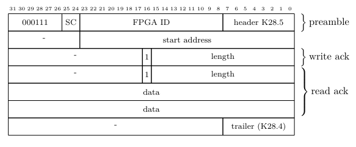

# Slow-Control Hub IP

## IP Description

**Name**: Slow-Control Hub  
**Description**: Interconnect SWB and FEB. Translate the Mu3e Slow-Control packet into Avalon Memory-Mapped transations. Support read/write in burst mode. Out-of-Order is not allowed.  
  
Version (_hw_tcl): 2.7.11  
Version (RTL): 3.1  
Version (qsys): 18.1  

## About Slow-Control Hub IP

This IP serves as the media layer translation between standard **Mu3e SC Packet** and Avalon Memory-Mapped (AVMM) transactions, which should be instantiated on the Frontend-Board (FEB).  
  
(SWB->FEB) **Mu3e SC command** from Switching-Board (SWB) is translated into AVMM read or write command.
(FEB->SWB) AVMM read or write respond is translated into **Mu3e SC reply (ack)**.
  
It features a backpressure fifo to queue the uplink Mu3e SC reply packet in order. 

Avalon burst and pipeline transaction are also added to natively support the incremental read/write of **Mu3e SC Packet**. 

The **SC command packet** has the format as following:

The **SC reply (ack) packet** has the format as following:

## Slow-Control Hub IP Parameters

| Parameter | Values | Description |
|:---------:|:------:|:-----------:|
|**Backpressure**|On or Off|Use a backpressure fifo for the uplink reply packet|

